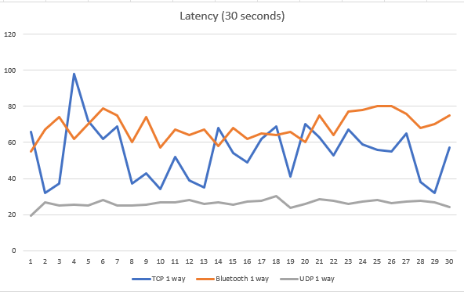
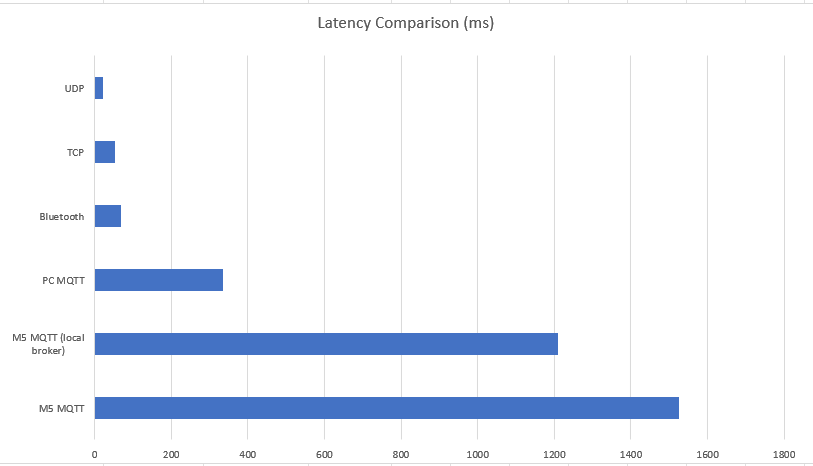
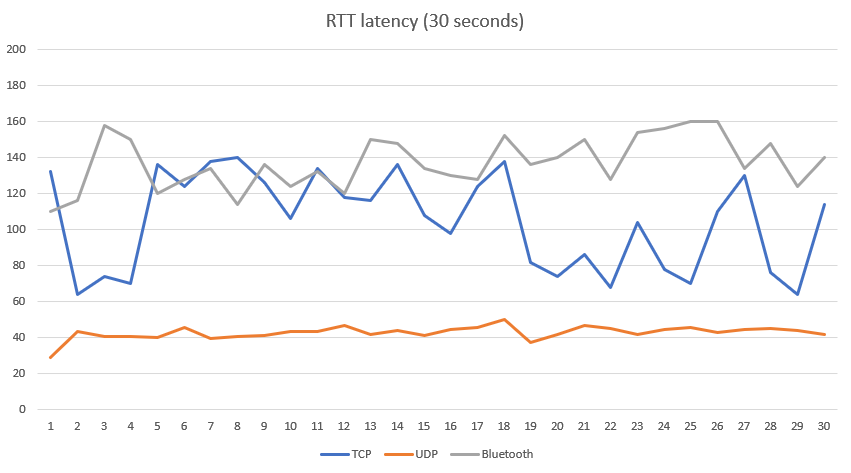
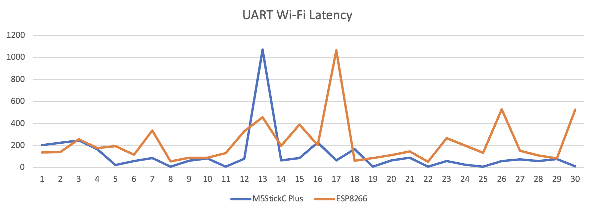
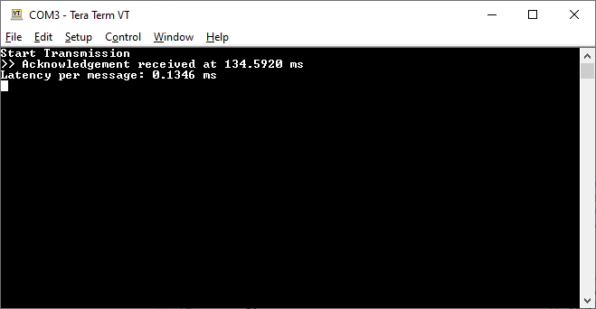
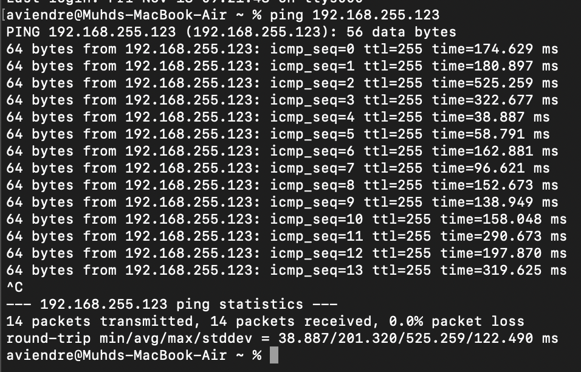

# CSC2003 Team A2 Communications Module
## Table of contents
* [IOT protocols](#iot-protocols)
* [UART Performance](#uart-performance)
* [Wi-Fi M5StickC PLUS](#wi-fi-m5stickc-plus)
* [Wi-Fi ESP8266](#wi-fi-esp8266)

## IOT protocols
### Environment Setup
#### - Tested using M5stickcplus
#### - 4G Hotspot: 127.22Mbps download
#### - Measured Using stopwatch app on a 120HZ refresh display Ipad Pro
#### - Captured Using Pixel 6 120FPS slowmotion video capture
#### - Note: M5stickcplus does not have an CMOS battery like PC/laptop to maintain time. It has to fetch the time from an NTP server which is not ms accurate, therefore we are unable to measure time using timestamp method. A physical setup was created to measure 1 way latency. High refresh display and capture is used to get latency as accurate as possible. We recorded the time on the stopwatch when the data was sent (the counter will increase on m5stick display), and when the data was received in the PC terminal.

### Lactency for 1 way

### Latency with MQTT

### Lactency for RTT
#### For RTT, we are able to measure using Python Time library

## UART Performance

|Technology          |Latency mean     |Latency standard deviation|Throughput
|--------------------|-----------------|-----------|-|
|Wi-Fi M5stickC Plus |116.407 ms       |193.483 ms|551.724 KB/s|
|Wi-Fi ESP8266       |193.483 ms       |207.000 ms|280.702 KB/s|

We collated thirthy samples of the Round-Trip-Time(RTT) and collated the data to identify the differences between the M5StickC Plus & ESP8266 to decide on the final implementation. We are able to use the ping feature on the computer to ping the respective modules to test latency with 64KB of data. We are able to calculate the throughput using the formula: 

`Throughput = Window Size (bits) / Round-Trip-Time (s)`

|Iterations          |M5stickC Plus (ms)    |ESP8266 (ms) |
|--------------------|-----------------|-----------|
|1	|203	|136.913|
|2	|225	|139.594|
|3	|247	|259.17|
|4	|167	|178.394|
|5	|22.6	|196.298|
|6	|60.2	|118.159|
|7	|86.9	|336.474|
|8	|9.52	|57.057|
|9	|63.4	|91.235|
|10	|84.1	|90.764|
|11	|8.19	|131.64|
|12	|80.1	|330.514|
|13	|1072	|457.9|
|14	|65.6	|199.489|
|15	|88.2	|389.765|
|16	|229	|203.078|
|17	|65	|1066.422|
|18	|169	|63.728|
|19	|8.12	|87.671|
|20	|66.7	|113.712|
|21	|89	|147.436|
|22	|7.61	|54.699|
|23	|59.1	|268.156|
|24	|27.8	|200.253|
|25	|6.87	|134.573|
|26	|59.7	|530.898|
|27	|74.6	|152.003|
|28	|58.8	|110.178|
|29	|78	|82.614|
|30	|10.1|	525.259|

We were also able to implement Bluetooth 4.0 LE through the M5StickC Plus. The theoretical throughput of 39.04 KB/s. After testing, we have decided to use the M5StickC Plus for the final integration into the car as it has proven to be more stable and provide a lower latency over the tests.

## Wi-Fi M5StickC PLUS
### Test Parameters:
Latency Test: 1000 characters sent sequentially

Throughput Test: 1KB message sent

### Result Images:

<ins>Latency Test</ins>

<ins>Throughput Test</ins>

## Wi-Fi ESP8266
### Test Parameters:
To check the round-trip-time, we used the ping feature within laptops. It will retrieve the minimum, average, maximum and standard deviation.

Latency Test: 64 bytes sent from Laptop to MSP432
